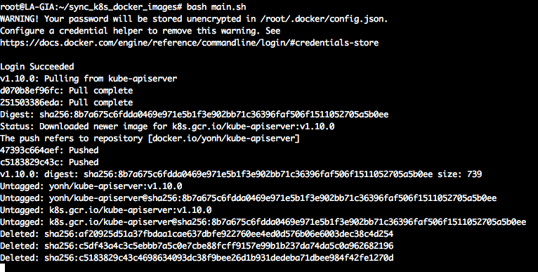

# sync_k8s_docker_images
同步 `k8s` 的 `docker` 镜像到 `Docker Hub`，也可以直接跳转到我的镜像中心仓库, [点击这里跳转](https://hub.docker.com/u/yonh)


```
# 生成travis-ci执行脚本
cat main.sh|grep -v \#\# > main_travis.sh
```

### 计划工作（如果有时间的话）

- [x] 简单实现同步镜像到Docker Hub
- [ ] 添加`TravisCI`的支持以实现不用服务器就能同步
- [ ] 支持国内各大厂的镜像中心上传

### 运行效果


